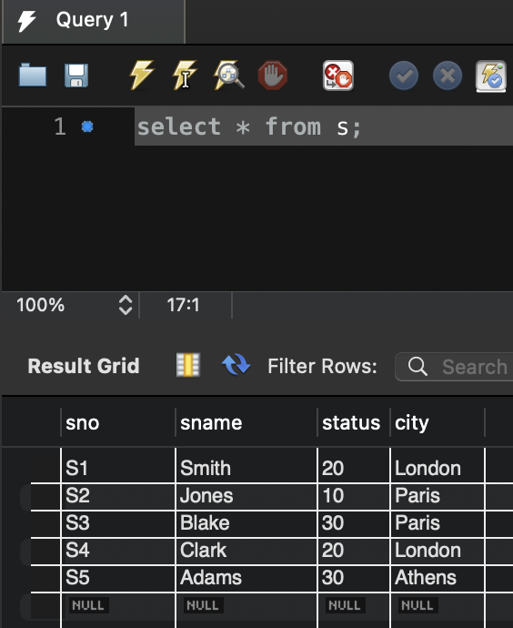
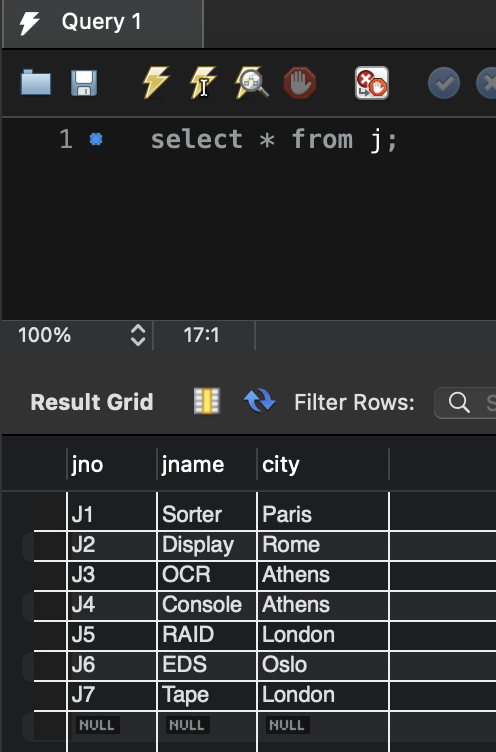
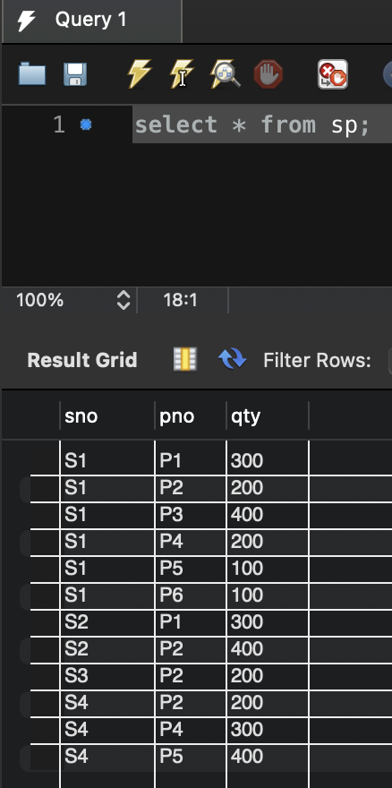

# 7.Relational-Algebra

### 🌷목표
> EER 다이어그램을 만들고 그 안의 엔터티들을 아래와 같이 넣었다. 
> 이 관계를 바탕으로 [sql query 실습](https://github.com/YeoJiSu/DataBase/blob/main/7.Relational-Algebra/query_7.sql)을 수행한다. 

### 🌷EER 다이어그램

### 🌷엔터티

 

